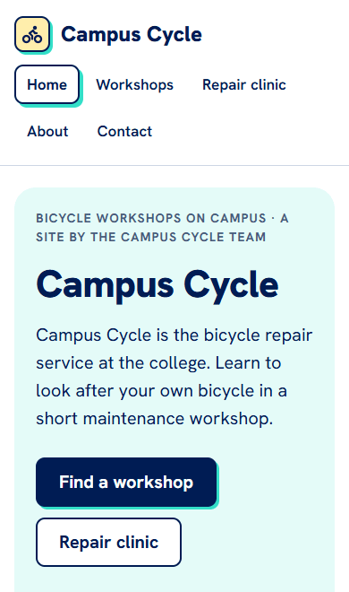
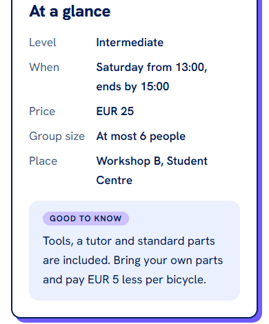
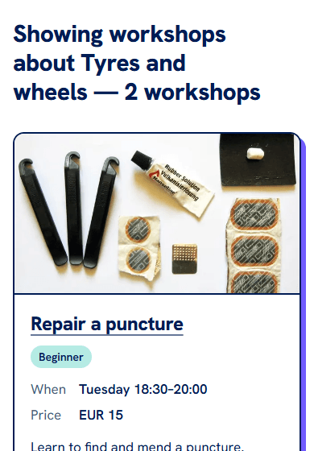
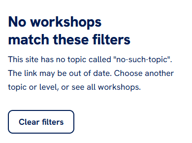
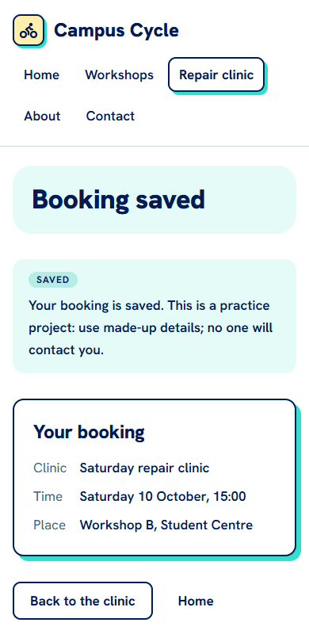
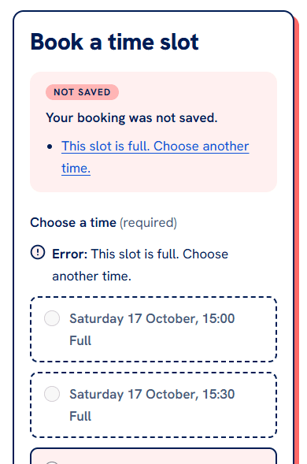
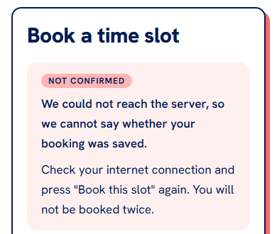
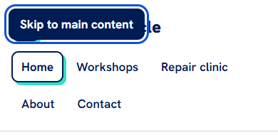

# UX decisions: why the starter looks and works the way it does

Campus Cycle follows the UX rules the course teaches. This guide shows the most important design
choices. For each one:

- **the state:** a screenshot of what a user sees (taken at a phone's width, 390 px);
- **the rule:** the course chapter, by title, and the rule it applies;
- **the file** that does it;
- **check it yourself:** a small check you can repeat on your own copy, after you change it.

These are choices for this site, with their trade-offs. They are not the only right answers, and none
of them promises more bookings or more users. When your project makes a different choice, decide it
(alone or with your team), and write down why in a decision record (`docs/decisions`).

---

## The two tasks come first

**The rule:** *UX Patterns and Trade-offs* (the hero, no carousel); *User Experience and Usability*.
A user comes to do one of two things: find a workshop, or book the repair clinic. The home page shows
one static hero with both as buttons, then the same two tasks again as panels below it.

**Trade-off:** the two destinations appear twice. That is on purpose: on a phone, the first screen
shows only the hero.

**The file:** `src/app/(site)/page.tsx` and `src/components/site/Hero.tsx`.

**Check it yourself:** open your home page at a phone's width (in your browser's developer tools).
Can you see both tasks on the first screen, without scrolling?

## One source per fact

**The rule:** *Information Architecture and Content Inventory*. Each fact is kept in one place, so
one change in `/admin` is right everywhere at once:

- a workshop's level, day, times, price and group size are fields of its own record;
- the pricing rule, the place and the e-mail address are in **Site facts** (`/admin` → Globals →
  **Site facts**), and every page that shows them reads them from there;
- descriptions and page texts are words only: they repeat none of these facts.

**The file:** `src/globals/SiteFacts.ts`, `src/collections/Workshops.ts`, and the pages that read
them.

**Check it yourself:** change the place in **Site facts**, save, and reload a workshop page, the
clinic page and the Contact page. All three show the new place.

**Who changes what** (*Content Strategy and Governance*):

| Content | Where it is changed | By whom |
| --- | --- | --- |
| Pages (home, about, contact, privacy), workshops, topics, repairs, images | `/admin` | editors |
| Site facts: the pricing rule, the place, the e-mail address | `/admin` → **Site facts** | editors |
| The clinic and its time slots | `/admin` → **Clinics**, **Time Slots** | editors |
| Bookings | made by users on the clinic page; moved or deleted in `/admin` | users, then editors |
| The tagline, the menu, the footer's text | the code (`src/components/site`) | developers |
| The look: colours, fonts, spacing | `src/app/(site)/globals.css` | developers |

Decide who the editors are on your own site, and write it in your hand-over (`docs/handover.md`).

**Retiring content safely.** Removing something is a change too, and the site refuses a removal that
would leave other records pointing at nothing:

- a topic that workshops still use cannot be deleted: remove it from each workshop first (its
  **Workshops** list shows which), then delete the topic;
- a time slot with bookings cannot be deleted: move or delete its bookings first. A past clinic's
  slots stay while bookings point at them, so its history is kept;
- a clinic with time slots cannot be deleted: move or delete its slots first.

The message in `/admin` says what to do first.

## Filters you can share

**The rule:** *Content Organisation Patterns* and *Navigation Patterns*; *Nielsen's Ten Usability
Heuristics*, 6 (recognition rather than recall) and 7 (flexibility and efficiency of use). Topic and
level are two separate filters. The chosen filters live in the page's address
(`/workshops?topic=brakes-and-gears&level=beginner`), so a filtered list can be shared, bookmarked
and reached again with Back, and it works without JavaScript. The result line repeats the filters in
words, with the count.

**The file:** `src/tasks/find-workshop/filters.ts`, `src/components/site/WorkshopFilters.tsx`,
`src/app/(site)/workshops/page.tsx`.

**Check it yourself:** filter the workshops, copy the address, and open it in a new private window.
You should see the same filtered list.

## An empty result explains itself

**The rule:** *Nielsen's Ten Usability Heuristics*, 3 (user control and freedom) and 9 (help users
recognise, diagnose and recover from errors). An old link to a removed topic does not crash and does
not pretend: it says what happened and offers **Clear filters**.

**The file:** `src/app/(site)/workshops/page.tsx`; the reasons are in
`src/tasks/find-workshop/README.md`.

**Check it yourself:** open `/workshops?topic=no-such-topic`. You should see the explanation and a
way back to all workshops.

## "Saved" only when it is saved

**The rule:** *Nielsen's Ten Usability Heuristics*, 1 (visibility of system status). While the form is
sent, its button says **Saving your booking…** and cannot be pressed again. The word "saved" appears
only on the confirmation page, which the server opens after the booking is stored. The confirmation
repeats the clinic, the time and the place, and says honestly that no one will contact the user.

**The file:** `src/components/site/BookingSubmitButton.tsx`,
`src/app/(site)/clinics/[slug]/booked/page.tsx`.

**Check it yourself:** book a time slot on your own copy with made-up details. Does the button say it
is saving? Does the confirmation show the time you chose?

## Errors say what to fix, and nothing typed is lost

**The rule:** *Form Design, Feedback and Error Recovery*; *Nielsen's Ten Usability Heuristics*, 9.
Every field is checked at once. A box at the top of the form lists the problems as links to their
fields, and gets the keyboard focus. Each field shows its own message, starting with "Error:" in
words, not only in colour. Labels stay visible above the fields; there are no placeholders. After a
problem, everything the user typed comes back.

**The file:** `src/components/site/BookingForm.tsx`, `src/components/site/BookingProblem.tsx`,
`src/components/site/FieldError.tsx`, `src/tasks/book-slot/createBooking.ts`.

**Check it yourself:** send the booking form empty. Then fill in only your name and send it again:
your name must still be there.

## A full slot cannot be booked

**The rule:** *Nielsen's Ten Usability Heuristics*, 5 (error prevention). Full slots stay visible but
cannot be chosen, with **Full** in words. The server checks again when it saves, so two people who
book the last place at the same moment never both get it. The one who loses reads "This slot is full.
Choose another time.", and the form shows every slot as it is now.

**The file:** `src/components/site/SlotPicker.tsx`, `src/tasks/book-slot/capacity.ts`.

**Check it yourself:** in `/admin`, set a time slot's **Places** to 1 and book it once. Reload the
clinic page: that slot now says **Full**.

## When the answer is lost, the site says it does not know

**The rule:** *Nielsen's Ten Usability Heuristics*, 1 and 9. When the connection drops, the site
cannot know whether the booking was saved, so it says exactly that, and keeps everything typed.
Sending again is safe: the same form never saves two bookings.

**The file:** `src/components/site/BookingForm.tsx`, `src/components/site/BookingProblem.tsx`,
`src/tasks/book-slot/typedValues.ts`, `src/tasks/book-slot/createBooking.ts`.

**Check it yourself:** in your browser's developer tools, switch the network to offline, then book.
You should see **Not confirmed**, not "Saved".

## Keyboard first

**The rule:** *Web Accessibility*; *Interaction Design: Affordances, Signifiers and Fitts's Law*. The
first Tab press shows **Skip to main content**. A blue focus ring shows where the keyboard is, on
everything, and is never removed. Buttons and menu links are at least 44 px high. Links are
underlined, so they do not rely on colour alone. The page you are on is marked in the menu.

**The file:** `src/components/site/Header.tsx`, `src/components/site/MainNav.tsx`,
`src/app/(site)/globals.css`.

**Check it yourself:** put your mouse away. Find a workshop and book a time slot with the keyboard
only (Tab, Shift+Tab, Enter, the arrow keys). Can you always see where you are?

---

## The ten pattern decisions

*UX Patterns and Trade-offs* asks for a reasoned choice for each common pattern. The starter's:

| Pattern | Decision | Trade-off |
| --- | --- | --- |
| Hero or carousel | One static hero: tagline, title, one sentence, two actions, one photo | Only one photo shows; the workshops section shows the others |
| Navigation depth | Five top-level destinations, each one click away | Topics are reached through Workshops, not the menu |
| Mobile menu | No menu button: the five links wrap onto two rows on a phone | The header is taller on a phone |
| Infinite scroll or pagination | The four workshops are all shown | A catalogue of dozens would need pages |
| Modal or inline | Everything inline; the confirmation is its own page | One more page load, but the confirmation can be reloaded |
| Whitespace | Related things close together, groups far apart (spacing tokens) | Pages are longer on a phone |
| Sticky header | Not sticky: it never covers the content or the focused element | The menu scrolls away on long pages |
| Labels or placeholders | Visible labels with "(required)" or "(optional)"; no placeholders | A hint takes a line of space |
| Breadcrumbs | One real parent only ("Workshops ›") | It repeats a menu link |
| Profile selection | None on the public site; the optional members' area is off by default | Editors create members in `/admin` |

## Known limits

- **The "page not found" page without JavaScript.** On your live site, an unknown address always gets
  the right "not found" answer. With JavaScript switched off, though, the page itself stays blank: the
  version of Next.js this starter uses draws that page in the browser. With JavaScript on (as for
  nearly everyone), it shows the explanation and the links Home and Workshops. A check in
  `tests/e2e/a11y.spec.ts` will tell the day Next.js changes this.
- **No user has tried it yet.** The checks above are the starter's own. Watching real users try your
  site is the step only you can do (below).

## Test it with users

*Usability Testing and Evaluation*: give a few people one of the two tasks, watch without helping,
and write down what they do. Keep what you **saw** (behaviour) apart from what you **think** it means
(interpretation) and from what you are **not sure** of (uncertainty). Fix the most important problem,
then test again. Write it all in `docs/test-report.md`.

## How to restyle your site in one place

Every colour, font, size and space of the site is a **design token** in
`src/app/(site)/globals.css`. Every component reads them, so one change there reaches every page.
The comment at the top of that file explains each group, with two examples:

- **Change the accent colour:** the offsets behind framed items and the marker on the current page
  use `--color-brand`. Make it coral: `--color-brand: var(--color-coral);`.
- **Change the heading font:** load a second font in `src/app/(site)/layout.tsx`, then point
  `--font-heading` at it.

Take colours only from the tokens; never type a colour value into a component. And keep the text on
coloured backgrounds dark (`--color-ink`): most of the bright accents are too light for text.

**Check it yourself:** after a change, check the contrast of your text with a contrast checker, and
tab through a page to see that the focus ring still stands out.

## How to adapt the two tasks

Each task has its own README, with what each file does, why it is built that way, and how to turn it
into a task of your own site:

- [Find a workshop by topic and level](../../src/tasks/find-workshop/README.md): for example, concerts
  by genre and city.
- [Book a clinic slot](../../src/tasks/book-slot/README.md): for example, seats for performances.

Keep what makes each task work for every user: the plain form with visible labels, the honest
messages, the made-up-data notice, and the tests.
